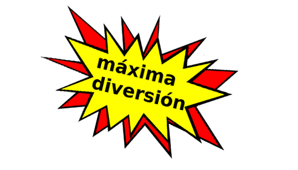

# Brexit Soundboard    

A simple Java Android app that plays memorable sound quotes from key Brexit politicians.

## 1. Latest Changes - January 2019

* Added Privacy Policy.
* More sound quotes added.
* Image rotation on ImageButtons.
* Persistance on button selection.
* Improved use of MediaPlayer.
* Button state preserved on rotation.
* Better use of various Firebase analytics.
* Started using CircleCI (with Firebase Test Lab); codecov; sonarcloud; Codacy.

## 2. Contribute
* Use the Suggestion Box in the app or a GitHub PR.